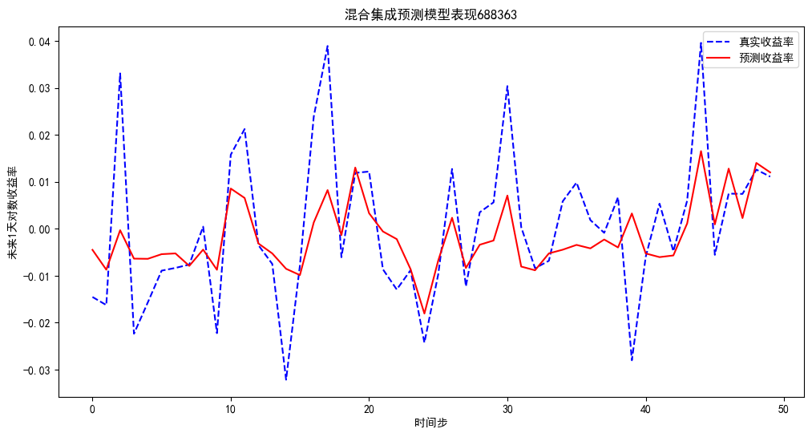
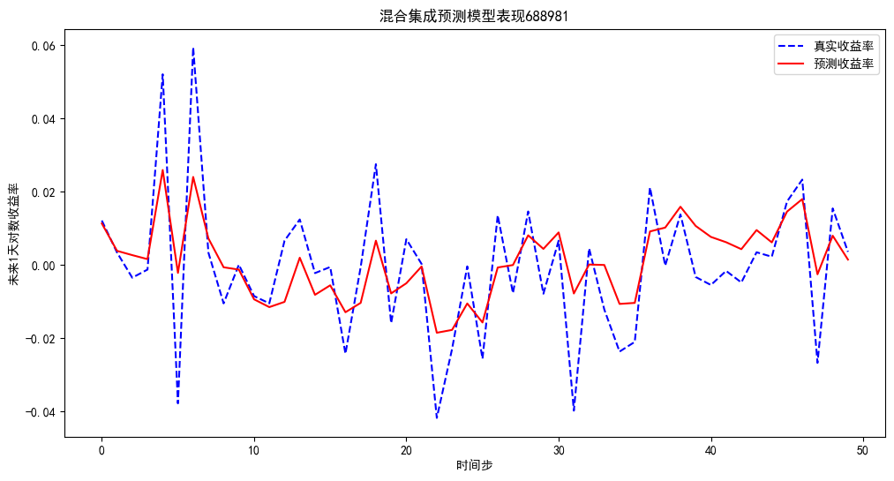

## 📌 项目介绍
本项目旨在利用 **混合集成学习方法** 对科创板公司股票的未来收益率进行预测。  
研究目标是结合 **技术指标** 与 **市场情绪因子**，在单模型与集成策略的基础上，提高股票涨跌方向预测的准确性。  

模型在科创板两家公司的数据上进行了实验，并在验证集上选择最优集成方式，最终在测试集上进行了收益率预测与可视化。

---

## 📊 数据与特征

### 1. 技术指标
#### (1) MACD 指标
- 短期 EMA (12日)：  
  $$
  EMA_{12}(t) = \alpha \times ClPr_t + (1 - \alpha) \times EMA_{12}(t-1), \quad \alpha = \frac{2}{1+12}
  $$
- 长期 EMA (26日)：  
  $$
  EMA_{26}(t) = \beta \times ClPr_t + (1 - \beta) \times EMA_{26}(t-1), \quad \beta = \frac{2}{1+26}
  $$
- DIF:  
  $$
  DIF(t) = EMA_{12}(t) - EMA_{26}(t)
  $$
- DEA:  
  $$
  DEA(t) = \gamma \times DIF(t) + (1 - \gamma) \times DEA(t-1), \quad \gamma = \frac{2}{1+9}
  $$
- MACD:  
  $$
  MACD(t) = 2 \times (DIF(t) - DEA(t))
  $$

#### (2) KDJ 指标
- RSV:  
  $$
  RSV(t) = \frac{ClPr_t - LowestLow(t)}{HighestHigh(t) - LowestLow(t)} \times 100
  $$
- K:  
  $$
  K(t) = \delta \times RSV(t) + (1 - \delta) \times K(t-1), \quad \delta = \frac{2}{1+3}
  $$
- D:  
  $$
  D(t) = \epsilon \times K(t) + (1 - \epsilon) \times D(t-1), \quad \epsilon = \frac{2}{1+3}
  $$
- J:  
  $$
  J(t) = 3K(t) - 2D(t)
  $$

#### (3) ATR 波动性指标
- 真实波幅 (TR):  
  $$
  TR(t) = \max(|HiPr_t - LoPr_t|, |HiPr_t - PrevClPr_t|, |LoPr_t - PrevClPr_t|)
  $$
- 平均真实波幅 (ATR):  
  $$
  ATR(t) = \frac{\sum_{i=t-14}^{t} TR(i)}{14}
  $$

### 2. 高频交易特征
- `周波动率(%)_VolatilityWk`  
- `换手率(%)_TurnRat_diff`  
- `周换手率(%)_TurnRatRecWk_diff`  
- `成交量(股)_diff`  
- 以上后缀为_diff的特征均采用差分形式。

### 3. 市场情绪特征（UMAP 降维）
通过股民评论的句子向量降维得到：
- **umap_1：市场情绪的极端变化维度** —— 表征情绪剧烈波动。  
- **umap_2：市场情绪的趋势维度** —— 衡量情绪的持续性变化。

---

## 🧑‍💻 模型方法

### 1. 单模型
- 线性回归（Linear Regression）  
- 岭回归（Ridge）  
- 随机森林（RandomForest）  
- 梯度提升树（GBDT）  
- XGBoost  

### 2. 集成策略
- Mean 平均集成  
- Median 中位数集成  
- Max 最大值集成  
- Min 最小值集成  
- Weighted 加权集成（权重示例：`[5, 3, 2, 2, 1]`）

最终选择验证集 RMSE 最小的集成方法作为预测模型。

---

## 📈 实验结果

### 华熙生物
- 测试集预测 RMSE: **0.012137**  
- 正对数收益率占比: **0.5167**  
- 负对数收益率占比: **0.4833**  
- 涨跌方向预测准确率: **0.7000**  
- 预测涨准确率（精确率）: **0.8824**  
- 预测跌准确率（精确率）: **0.6279**  
- 召回率: **0.9310**



---

### 中芯国际
- 测试集预测 RMSE: **0.013183**  
- 正对数收益率占比: **0.4412**  
- 负对数收益率占比: **0.5441**  
- 涨跌方向预测准确率: **0.7500**  
- 预测涨准确率（精确率）: **0.6944**  
- 预测跌准确率（精确率）: **0.8125**  
- 召回率: **0.7027**  



---

## ⚙️ 使用方法

### 1. 环境配置
请确保已安装以下依赖：
```bash
pip install numpy pandas matplotlib scikit-learn xgboost
```

### 2. 环境配置

项目使用 Excel 文件作为数据输入：

```
688981_v3.xlsx
688363_v3.xlsx
```

其中包含所有特征与目标变量 **对数收益率**。

### 3. 运行方式

进入项目文件夹：

```
The-hybrid-ensemble-model-predicts-the-return-rate-of-stocks-on-the-STAR-Market
```

直接运行 Jupyter Notebook 文件：

```
Hybrid_Ensemble_Model.ipynb
```

在 Notebook 中可逐步执行代码，完成数据处理、模型训练与预测。

### 📊 公司对比表

| 指标 | 华熙生物 | 中芯国际 |
|------|--------|----------------|
| 测试集预测 RMSE | 0.012137 | 0.013183 |
| 正对数收益率占比 | 0.5167 | 0.4412 |
| 负对数收益率占比 | 0.4833 | 0.5441 |
| 涨跌方向预测准确率 | 0.7000 | 0.7500 |
| 预测涨准确率（精确率） | 0.8824 | 0.6944 |
| 预测跌准确率（精确率） | 0.6279 | 0.8125 |
| 召回率 | 0.9310 | 0.7027 |

---

## 📌 总结与展望
- 两家公司实验结果表明，**混合集成模型**在不同股票上都能取得较好的预测表现；  
- 华熙生物 在 **预测涨（精确率）** 和 **召回率** 上表现更优；  
- 中芯国际 在 **涨跌方向预测准确率** 和 **预测跌的精确率** 上更具优势；  
- 表明模型对不同股票可能有不同偏好，需要进一步优化集成策略；  
- 未来研究方向：  
  - 引入更多 **深度学习时序模型**；  
  - 增加 **宏观经济与跨市场因子**和更多**高频数据特征**；  
  - 研究 **动态权重集成** 提升稳健性。
  - 对情绪因子进行更精细化建模  

---
