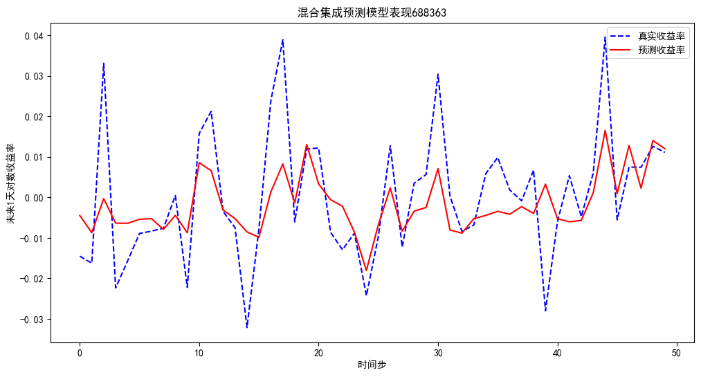

Github-[MAOYUQI](yuki-820/My-project-code-and-independent-research: This repository stores all the project and independent research codes and essays mentioned in my resume)

原始数据来源：东方财富吧，RESSET数据库

## 📌 项目介绍
本项目旨在利用 **混合集成学习方法** 对科创板公司股票的未来收益率进行预测。  
研究目标是结合 **技术指标** 与 **市场情绪因子**，在单模型与集成策略的基础上，提高股票涨跌方向预测的准确性。  

模型在科创板两家公司的数据上进行了实验，并在验证集上选择最优集成方式，最终在测试集上进行了收益率预测与可视化。

---

## 📊 数据与特征

### 1. 技术指标
#### (1) MACD 指标
- 短期 EMA (12日)：  
  $$
  EMA_{12}(t) = \alpha \times ClPr_t + (1 - \alpha) \times EMA_{12}(t-1), \quad \alpha = \frac{2}{1+12}
  $$
- 长期 EMA (26日)：  
  $$
  EMA_{26}(t) = \beta \times ClPr_t + (1 - \beta) \times EMA_{26}(t-1), \quad \beta = \frac{2}{1+26}
  $$
- DIF:  
  $$
  DIF(t) = EMA_{12}(t) - EMA_{26}(t)
  $$
- DEA:  
  $$
  DEA(t) = \gamma \times DIF(t) + (1 - \gamma) \times DEA(t-1), \quad \gamma = \frac{2}{1+9}
  $$
- MACD:  
  $$
  MACD(t) = 2 \times (DIF(t) - DEA(t))
  $$

#### (2) KDJ 指标
- RSV:  
  $$
  RSV(t) = \frac{ClPr_t - LowestLow(t)}{HighestHigh(t) - LowestLow(t)} \times 100
  $$
- K:  
  $$
  K(t) = \delta \times RSV(t) + (1 - \delta) \times K(t-1), \quad \delta = \frac{2}{1+3}
  $$
- D:  
  $$
  D(t) = \epsilon \times K(t) + (1 - \epsilon) \times D(t-1), \quad \epsilon = \frac{2}{1+3}
  $$
- J:  
  $$
  J(t) = 3K(t) - 2D(t)
  $$

#### (3) ATR 波动性指标
- 真实波幅 (TR):  
  $$
  TR(t) = \max(|HiPr_t - LoPr_t|, |HiPr_t - PrevClPr_t|, |LoPr_t - PrevClPr_t|)
  $$
- 平均真实波幅 (ATR):  
  $$
  ATR(t) = \frac{\sum_{i=t-14}^{t} TR(i)}{14}
  $$

### 2. 高频交易特征
- `周波动率(%)_VolatilityWk`  
- `换手率(%)_TurnRat_diff`  
- `周换手率(%)_TurnRatRecWk_diff`  
- `成交量(股)_diff`  
- 以上后缀为_diff的特征均采用差分形式。

### 3.股民评论数据处理与情绪向量降维

 在本研究中，我们利用东方财富网的股民评论数据来构建市场情绪特征，我们设计了一个完整的处理流程，包括评论数据的词向量化、时间衰减加权、降维处理等环节，最终生成每日的市场情绪特征向量。
#### 评论数据的预处理与词向量化

我们首先对股民评论数据进行分词、去停用词处理，然后训练 **Word2Vec** 或 **FastText** 模型，将每条评论转换为词向量的均值表示：
```python
import jieba
import numpy as np
import pandas as pd
from gensim.models import Word2Vec, FastText

# 分词及去停用词
stop_words = set(["的", "了", "是", "和", "也", "都", "就", "在"])
def tokenize(text):
    return [word for word in jieba.lcut(text) if word not in stop_words]

df["tokenized"] = df["comment"].astype(str).apply(tokenize)

# 训练 Word2Vec 或 FastText
use_fasttext = False
if use_fasttext:
    model = FastText(sentences=df["tokenized"].tolist(), vector_size=100, window=5, min_count=2, workers=4)
else:
    model = Word2Vec(sentences=df["tokenized"].tolist(), vector_size=100, window=5, min_count=2, workers=4)

# 获取均值词向量
def get_mean_vector(words, model):
    vectors = [model.wv[word] for word in words if word in model.wv]
    return np.mean(vectors, axis=0) if vectors else np.zeros(model.vector_size)

df["vector"] = df["tokenized"].apply(lambda x: get_mean_vector(x, model))
``` 

为什么采用词向量化？

词向量可以捕捉语义信息，使得文本数据能够在连续的空间中表示，适用于机器学习模型的输入。

Word2Vec 采用词共现关系来训练词向量，能较好地捕捉语义相似性。

FastText 进一步考虑了子词信息，对拼写相似的词（如“涨停”和“涨停板”）能更好地建模，适用于处理股民评论中的多变表达。

#### 时间衰减加权建模市场情绪

由于股民评论的影响随时间衰减，我们引入 **指数衰减加权** 来计算每日市场情绪向量。公式如下：

$$
w_{time}(t) = e^{-\lambda \cdot (T - t)}
$$

其中：

- $ w_{time}(t) $ 是时间衰减权重；
- $ T $ 是目标日期，$ t $ 是评论的发布时间；
- $ \lambda $ 是衰减率，决定了过去评论的重要性。

此外，我们还利用 **评论的浏览量** 作为权重，强调高浏览量的评论在市场情绪中的影响。最终的加权情绪向量计算方式如下：

$$
\mathbf{V}_{final} = \frac{\sum_i w_{final}^i \cdot \mathbf{V}_i}{\sum_i w_{final}^i}
$$

其中：

- $ w_{final}^i = w_{time}^i \times views^i $ 是综合权重；
- $ \mathbf{V}_i $ 是评论的词向量；
- 结果向量采用**指数移动平均法**进行平滑，以确保连续性。

```python
lambda_decay = 0.1
alpha = 0.9
previous_vector = None
results = []

for target_date in date_range:
    past_comments = df[df["date"] <= target_date].copy()
  
    if not past_comments.empty:
        past_comments["time_diff"] = (target_date - past_comments["date"]).dt.total_seconds() / 3600
        past_comments["w_time"] = np.exp(-lambda_decay * past_comments["time_diff"])
        past_comments["w_final"] = past_comments["w_time"] * past_comments["views"]
      
        weighted_vectors = np.array([past_comments["w_final"].iloc[i] * past_comments["vector"].iloc[i] for i in range(len(past_comments))])
        final_vector = np.sum(weighted_vectors, axis=0) / np.sum(past_comments["w_final"])
      
        previous_vector = alpha * final_vector + (1 - alpha) * previous_vector if previous_vector is not None else final_vector
    else:
        final_vector = previous_vector if previous_vector is not None else np.zeros(model.vector_size)
  
    results.append([target_date] + final_vector.tolist())
```

##### **为何使用时间衰减加权？**

- **更贴近市场反应**：近期的评论对市场情绪的影响更大，历史评论影响逐渐减弱。
- **结合浏览量权重**，确保市场更关注的评论对情绪向量的贡献更高。

---

#### 使用 UMAP 降维情绪向量

我们采用 **UMAP（Uniform Manifold Approximation and Projection）** 进行降维，将高维词向量映射到二维空间，以便用于时序预测。

```python
from umap import UMAP

vector_dim = model.vector_size
columns = ["date"] + [f"vector_{i}" for i in range(vector_dim)]
result_df = pd.DataFrame(results, columns=columns)

umap_model = UMAP(n_components=2, random_state=42)
umap_vectors = umap_model.fit_transform(result_df.iloc[:, 1:])  # 只对向量部分降维

result_df["umap_1"], result_df["umap_2"] = umap_vectors[:, 0], umap_vectors[:, 1]
```

##### **UMAP 降维的作用及二维向量的解释**

- **umap_1：市场情绪的极端变化维度**，主要反映市场情绪的波动程度（正负面情绪的剧烈程度）。
- **umap_2：市场情绪的趋势维度**，衡量市场情绪的持续性变化（正面或负面情绪的持续时间）。

---

## 🧑‍💻 模型方法

### 1. 单模型
- 线性回归（Linear Regression）  
- 岭回归（Ridge）  
- 随机森林（RandomForest）  
- 梯度提升树（GBDT）  
- XGBoost  

### 2. 集成策略
- Mean 平均集成  
- Median 中位数集成  
- Max 最大值集成  
- Min 最小值集成  
- Weighted 加权集成（权重示例：`[5, 3, 2, 2, 1]`）

最终选择验证集 RMSE 最小的集成方法作为预测模型。

---

## 📈 实验结果

### 华熙生物
- 测试集预测 RMSE: **0.012137**  
- 正对数收益率占比: **0.5167**  
- 负对数收益率占比: **0.4833**  
- 涨跌方向预测准确率: **0.7000**  
- 预测涨准确率（精确率）: **0.8824**  
- 预测跌准确率（精确率）: **0.6279**  
- 召回率: **0.9310**



---

### 中芯国际
- 测试集预测 RMSE: **0.013183**  
- 正对数收益率占比: **0.4412**  
- 负对数收益率占比: **0.5441**  
- 涨跌方向预测准确率: **0.7500**  
- 预测涨准确率（精确率）: **0.6944**  
- 预测跌准确率（精确率）: **0.8125**  
- 召回率: **0.7027**  


---

## ⚙️ 使用方法

### 1. 环境配置
请确保已安装以下依赖：
```bash
pip install numpy pandas matplotlib scikit-learn xgboost
```

### 2. 环境配置

项目使用 Excel 文件作为数据输入：

```
688981_v3.xlsx
688363_v3.xlsx
```

其中包含所有特征与目标变量 **对数收益率**。

### 3. 运行方式

进入项目文件夹：

```
The-hybrid-ensemble-model-predicts-the-return-rate-of-stocks-on-the-STAR-Market
```

直接运行 Jupyter Notebook 文件：

```
Hybrid_Ensemble_Model.ipynb
```

在 Notebook 中可逐步执行代码，完成数据处理、模型训练与预测。

### 📊 公司对比表

| 指标 | 华熙生物 | 中芯国际 |
|------|--------|----------------|
| 测试集预测 RMSE | 0.012137 | 0.013183 |
| 正对数收益率占比 | 0.5167 | 0.4412 |
| 负对数收益率占比 | 0.4833 | 0.5441 |
| 涨跌方向预测准确率 | 0.7000 | 0.7500 |
| 预测涨准确率（精确率） | 0.8824 | 0.6944 |
| 预测跌准确率（精确率） | 0.6279 | 0.8125 |
| 召回率 | 0.9310 | 0.7027 |

---

## 📌 总结与展望
- 两家公司实验结果表明，**混合集成模型**在不同股票上都能取得较好的预测表现；  
- 华熙生物 在 **预测涨（精确率）** 和 **召回率** 上表现更优；  
- 中芯国际 在 **涨跌方向预测准确率** 和 **预测跌的精确率** 上更具优势；  
- 表明模型对不同股票可能有不同偏好，需要进一步优化集成策略；  
- 未来研究方向：  
  - 引入更多 **深度学习时序模型**；  
  - 增加 **宏观经济与跨市场因子**和更多**高频数据特征**；  
  - 研究 **动态权重集成** 提升稳健性。
  - 对情绪因子进行更精细化建模  

---